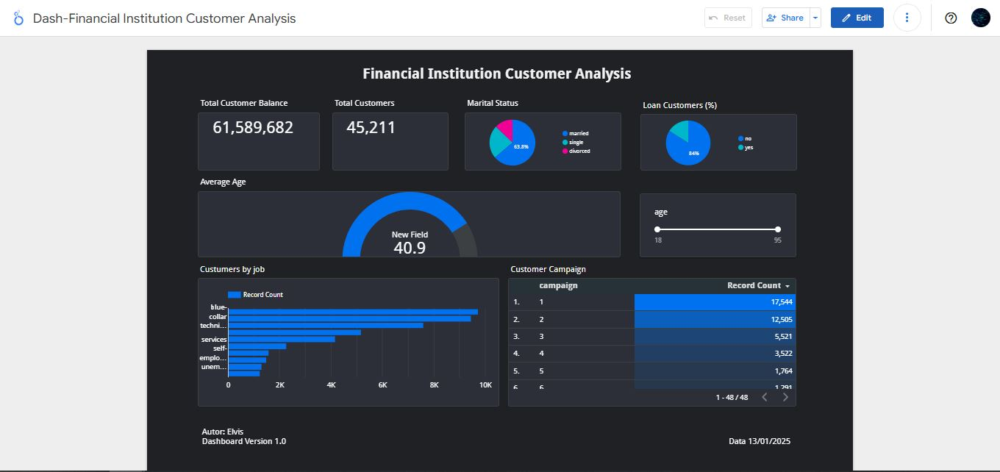

# Customer Analysis With Looker Studio

________________________________________________________________________________________________

# Metrics and Analysis

Below is a brief description of the key metrics used:

1. **Total Customer Balance**  
   Represents the total amount of money deposited or maintained by all customers in their accounts.  
   *Helps the financial institution evaluate its liquidity, potential profitability, and how much capital is held by its customers.*

2. **Total Customers**  
   Refers to the total number of customers associated with the financial institution.  
   *Important for measuring market reach, growth, and the size of the client base over time.*

3. **Marital Status**  
   Indicates the marital status of customers (e.g., single, married, divorced).  
   *Useful for customer segmentation, understanding different financial needs or behaviors, and tailoring products accordingly.*

4. **Loan Customers (%)**  
   Represents the percentage of customers who have taken loans compared to the total number of customers.  
   *Important for assessing credit risk exposure and identifying opportunities to offer credit-related products.*

5. **Customers by Job**  
   Describes the distribution or breakdown of customers by their occupation or profession.  
   *Allows institutions to better understand customer profiles, determine risks associated with different occupations, and provide targeted financial solutions based on income and job stability.*

6. **Customers Campaign**  
   Refers to the analysis of marketing campaigns targeted toward customers, tracking their effectiveness or response rates.  
   *Helps evaluate which campaigns generate higher engagement, identify strategies that resonate with customers, and optimize future marketing efforts.*
